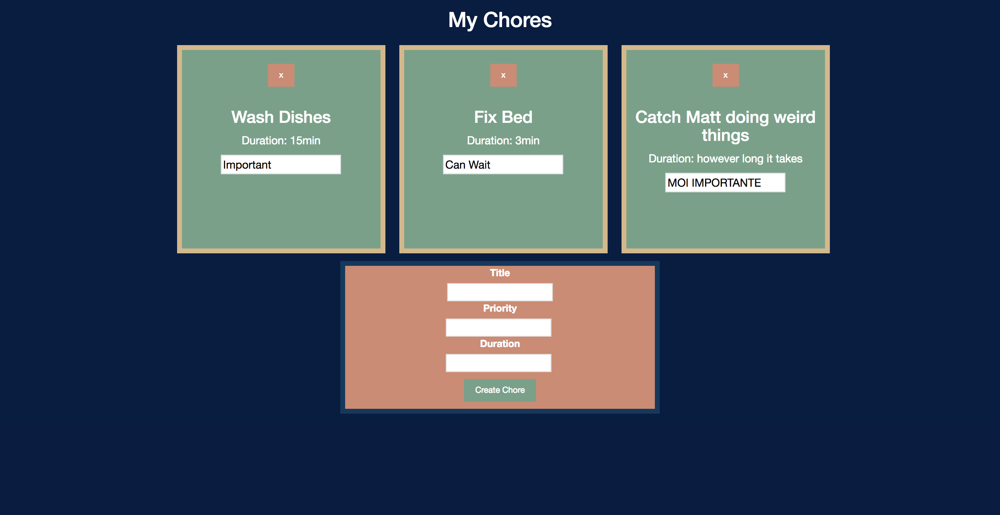

# More Chores
_Mom's been on your back for a solid week now. ughhhh._
We're building an app to keep track of your chores -- what, when, and how important they are!

---

There are a few things already built out for you!
  * `index.html` with bootstrap, jquery, and a css sheet linked! 😲
  * `index.html` also has some containers, some text, and a form
  * `index.html` has two different scripts:
   1. Running a completed version of this app
   2. An empty JS file (for you to work on 😄)

### Getting started
We'll be using json-server as a fake RESTful API. We can still make any type of request (get, post, put, delete)

to install run:
  npm install -g json-server
to start server:
  json-server --watch db.json
navigate to 'http://localhost:3000/chores' to see your first few chores!

---

### Completed Demo
_a little inspiration_


---

### GET chores
Make a `fetch` to `get` your chore data

### Render chores
Take your newly found data and make some chore cards. This beautiful ui will help motivate you!
To get your chore card looking right, follow this chore template:

```html
<div class="chore-card">
  <button class="delete-button" data-id="1">x</button>
  <h3> Wash Dishes </h3>
  <p> Duration: 15min </p>
  <input><!-- value should have the importance  -->
</div>
```

Our final product should look something like this:


### POST a chore
You're real busy, so you need to add a few more chores to your list!

Luckily, there's already a form built into your HTML. A new chore needs three attributes - a title, a priority, and a duration.

* On submit, the form should send a POST request to our API and the chore should be added to our chore list.
* We should also then render the new chore to our chore container.

To add a chore, we'll need to configure our options in fetch a little. `fetch` takes an optional second argument, a configuration object.
These options should look a bit like this:
```js
  {
    method: 'POST',
    headers: {
      'Content-Type': 'application/json',
      'Accepts': 'application/json'
    },
    body: JSON.stringify({
      myKey: 'myValue',
      myOtherKey: 'myOtherValue'
    })
  }
```

A quick note on config:
  * `method` is the HTML verb you're using
  * `headers` contain the type of data you're sending
  * `body` contains the key value pairs that will be sent as params

There are more options you can configure. Take a look at [the fetch docs][fetch-docs] for a little more info.


### DELETE chores
Whew, after all your hard work, you're ready to start completing chores. There's literally nothing more satisfying than crossing chores off the list!

Remember that little `x` button? When you click on that, it should do two things:
  * Send a delete request to your API
  * Remove the chore card from the chore list

What information does json-server need to know in order to remove a chore?


[fetch-docs]: https://developer.mozilla.org/en-US/docs/Web/API/Fetch_API/Using_Fetch
